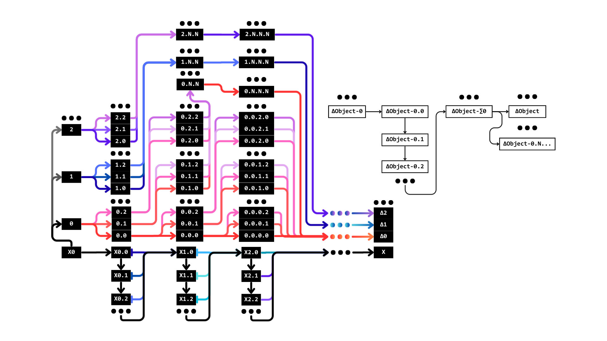

# Github

## Branches

---
[**X0**](https://github.com/xblackcore/MATRIX/tree/X0)
---
> [0](https://github.com/xblackcore/MATRIX/tree/0)
> ---
>> [0.0](https://github.com/xblackcore/MATRIX/blob/0.0)
>> ---
>>> [ΔREADME.md-0.0](https://github.com/xblackcore/MATRIX/blob/ΔREADME.md-0.0/README.md)
>>>
>>> [Δ.gitignore-0.0](https://github.com/xblackcore/MATRIX/blob/Δ.gitignore-0.0/.gitignore)
>>>
>>> [ΔXPY-0.0](https://github.com/xblackcore/MATRIX/tree/ΔXPY-0.0)
>>>> [ΔXPY-0.0.pyproject.toml-0](https://github.com/xblackcore/MATRIX/blob/ΔXPY-0.0.pyproject.toml-0/XPY_/pyproject.toml)
>>>>
>>>> [ΔXPY-0.0.XPY.py-0](https://github.com/xblackcore/MATRIX/blob/ΔXPY-0.0.XPY.py-0/XPY_/XPY.py)
>>>
>>> [Δ.vscode-0.0](https://github.com/xblackcore/MATRIX/tree/Δ.vscode-0.0)
>>>> [Δ.vscode-0.0.settings.json-0](https://github.com/xblackcore/MATRIX/blob/Δ.vscode-0.0.settings.json-0/.vscode/settings.json)
>>>
>>> [Δ.NV-0.0](https://github.com/xblackcore/MATRIX/tree/Δ.NV-0.0)
>>>
>>> [Δdesktop.ini-0.0](https://github.com/xblackcore/MATRIX/blob/Δdesktop.ini-0.0/desktop.ini)
>>>
>>> ---
> [X0.0](https://github.com/xblackcore/MATRIX/tree/X0.0)
> ---
[**X**](https://github.com/xblackcore/MATRIX/tree/X)
---
